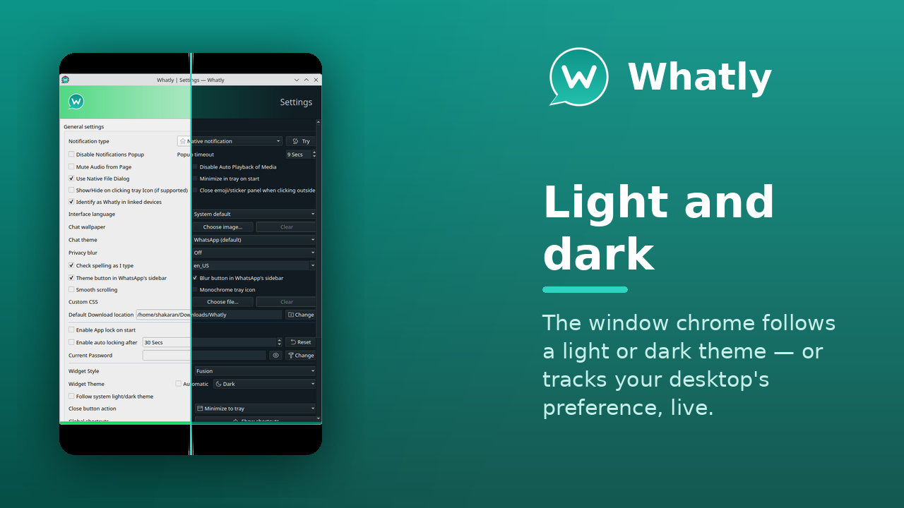
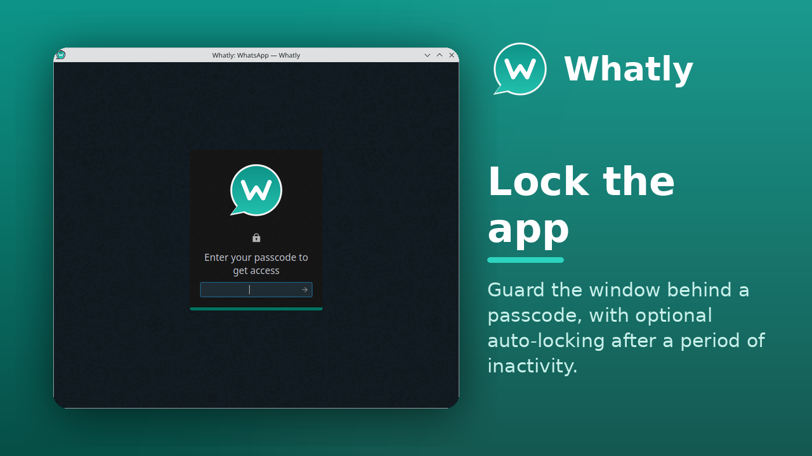
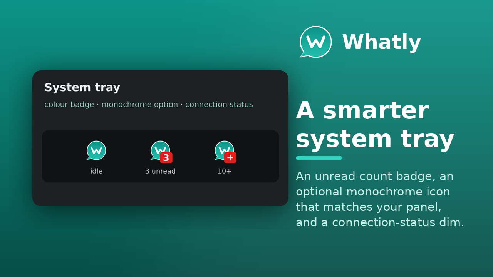
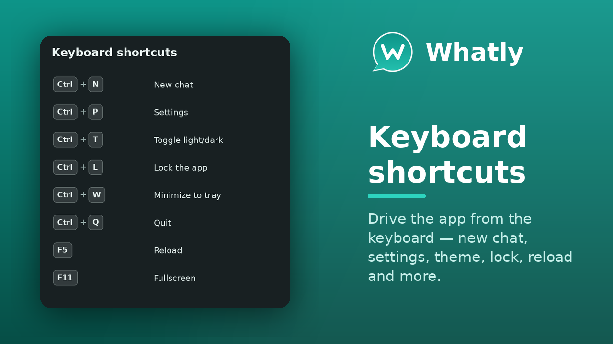
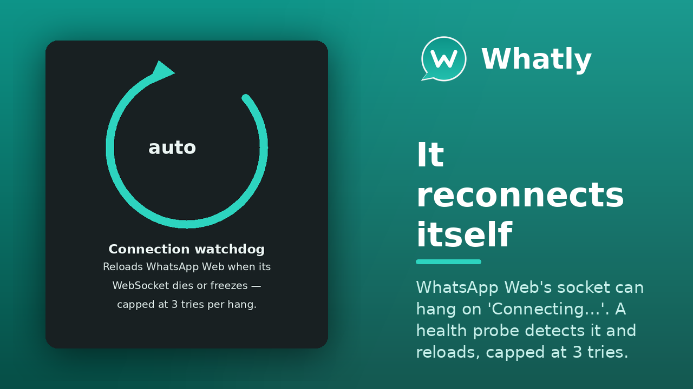

<div align="center">


# Whatly

**A feature-rich desktop client for WhatsApp Web.**
Native window, system tray, notifications, chat themes, privacy blur,
multiple accounts, spell-check and more — on **Linux** and **Windows**.

[](https://github.com/shakaran/whatly/releases/latest)
[](https://github.com/shakaran/whatly/actions/workflows/windows-build.yml)
[](https://github.com/shakaran/whatly/releases)
[](LICENSE)
[](https://github.com/shakaran/whatly/stargazers)


<br/>


</div>

---

> **This is a fork.** It is maintained by [Ángel Guzmán Maeso](https://shakaran.net)
> ([@shakaran](https://github.com/shakaran)) and builds on the original
> [WhatSie](https://github.com/keshavbhatt/whatsie) created by
> **Keshav Bhatt**, which remains MIT-licensed. All upstream copyright and
> authorship is preserved — see [LICENSE](LICENSE). *Whatly is not affiliated
> with, endorsed by, or connected to WhatsApp or Meta.*

## ✨ Highlights

|  |  |
|---|---|
| 👥 **Multiple accounts** | Separate windows *or* tabs in one window, each a fully separate session. The tray badge sums the unread count across them all. |
| 🎨 **Chat themes** | 14 themes that recolour WhatsApp Web itself, plus your own **wallpaper** behind the messages and load-your-own **custom CSS**. |
| 🕶️ **Privacy blur** | Blur the chat list and open conversation until you hover, so nobody reads over your shoulder. Five levels. |
| 🔤 **Spell checker** | Actually works — Chromium `.bdic` dictionaries are shipped, and you can check against **several languages at once**. |
| 🖥️ **Native integration** | System tray with a **monochrome** option and live connection status, desktop notifications, an app lock, a download manager, global shortcuts. |
| 🌗 **Follows your desktop** | Optionally track the system light/dark preference, live. |
| 🌍 **15 languages** | The interface is translated, with an in-app language picker. |
| 🪟 **Windows 10+** | One codebase, native toasts and a proper GUI executable. |

## What Whatly is (and is not)

Whatly is a **desktop wrapper around [web.whatsapp.com](https://web.whatsapp.com)**.
It gives WhatsApp Web a native window with system integration — tray, notifications,
themes, an app lock, shortcuts, a download manager — but the chat interface itself
is WhatsApp's own web client, running in Qt WebEngine.

That distinction decides where a problem belongs:

- **WhatsApp Web's limits are not Whatly bugs.** WhatsApp Web lags behind the
  phone app for some message types, so you may see *"your version of WhatsApp Web
  doesn't support it"*. The same message appears in Chrome or Firefox — only Meta
  can change that.
- **WhatsApp Web's shortcuts come from WhatsApp**, not from Whatly, so they never
  appear in the app's shortcut list (see [Keyboard shortcuts](#keyboard-shortcuts)).
- **Whatly is not a WhatsApp client of its own**: it does not implement the
  protocol, store your messages or talk to WhatsApp's servers directly.

## What's new in this fork

On top of upstream WhatSie, this fork adds:

- **Multiple WhatsApp accounts** — either as separate windows with
  `whatly --profile=<name>`, or as tabs inside one window. Each account is a
  fully separate session with its own storage; the tray badge sums the unread
  count across all of them. Add a tab with the **+**, and rename or remove one by
  right-clicking it. With a single account the tab bar is hidden, so nothing
  changes if you do not use this.
- **Spell checker** — actually works now. Qt WebEngine needs Chromium `.bdic`
  dictionaries, not hunspell's; the fork converts and ships them, so the language
  list is no longer empty. Pick **one or several** languages in Settings and
  Chromium checks against all of them at once.
- **Chat themes, wallpaper and a privacy blur** — recolour WhatsApp Web (14
  themes), set your own image behind the chats, or blur them until you hover so
  nobody reads over your shoulder. Toggle the theme and the blur from buttons in
  WhatsApp's own sidebar.
- **Custom CSS and smooth scrolling** — load a community stylesheet (catppuccin
  and friends) to restyle WhatsApp Web, and turn on animated scrolling.
- **A smarter system tray** — an optional **monochrome** icon that matches your
  panel, an unread-count badge, and a **connection-status** dim when WhatsApp is
  offline.
- **Follow the system light/dark theme**, live, if you want the window chrome to
  track your desktop.
- **A bug report you can actually file** — <kbd>F1</kbd> opens About; its *Report
  a Bug* button opens a GitHub issue with the version, commit, memory use of the
  whole process tree, and the recent log (including WhatsApp Web's console)
  already filled in.
- **Windows 10+ support** from a single codebase — platform-specific pieces are
  behind `Q_OS_*` guards, so Linux behaviour is unchanged. Native toast
  notifications, Win32 Caps Lock detection and a GUI-subsystem executable with
  icon/version resources. Every push is compile-checked by a Windows CI workflow.
- **Connection watchdog** — WhatsApp Web's WebSocket can die or freeze, leaving
  the app stuck on *"Connecting…"* with messages that never send. A health probe
  now detects it and reloads the page automatically, capped at 3 attempts per
  hang so an unfixable cause (no disk space, network down) never turns into a
  reload loop.
- **Self-updating User-Agent** — the reported Chrome version is derived from the
  bundled Chromium instead of being hardcoded, so it can no longer go stale and
  get the client treated as an outdated browser. It follows Qt WebEngine upgrades
  automatically.
- **"Identify as Whatly in linked devices"** — linked sessions show up on your
  phone as *"Whatly for Linux"* (or the matching platform) with a desktop icon,
  instead of a generic *"Google Chrome (Linux)"*. Applies to devices linked
  afterwards.
- **"Close emoji/sticker panel when clicking outside"** (opt-in) — WhatsApp Web
  otherwise keeps the expressions panel open until its button is pressed again.
- **It no longer stalls a KDE logout, and Quit actually quits** — the
  minimize-to-tray veto used to cancel the session-end close, so logging out
  waited on the app; a session-end close is now honoured as a real quit.
- **Safer cache clearing** — the "clear cache" action refuses any path that is
  not inside the app's own storage, so it can never run a recursive delete on
  your home directory.

## Screenshots

<div align="center">













</div>

<sub>The chat list is shown with the <b>privacy blur</b> on — that is the feature in action, not a redaction.</sub>

## Key features

- Light and Dark themes with automatic, time-based switching — or **follow the system**
- Native desktop notifications *and* a configurable custom popup
- Global keyboard shortcuts
- Built-in download manager
- Mute audio, disable notifications, do-not-disturb
- App lock, with auto-lock after an interval
- Hardware-permission manager (camera, microphone, …)
- Spell checker with 31 dictionaries, **several active at once**
- Fine-grained control over the web view:
	+ Full-view mode, configurable page zoom per window state
	+ Native vs. custom notifications, configurable popup timeout
	+ Disable auto-playback of media
	+ Minimize to tray on start, single-click hide to tray
	+ Switchable download location
	+ Configurable close-button action and User-Agent
	+ Storage management (clear residual cache and persistent data — safely)
	+ Close emoji/sticker panel when clicking outside (opt-in)
	+ Identify as Whatly in linked devices, with a desktop icon

## Install

### Linux

**Snap** — on any distribution with `snapd`:

```bash
snap install whatly
```

**Arch (AUR)** — the community [`whatsie-git`](https://aur.archlinux.org/packages/whatsie-git)
package (maintained by [M0Rf30](https://github.com/M0Rf30)) tracks the **upstream**
WhatSie project, not this fork:

```bash
yay -S whatsie-git
```

Prebuilt binaries are attached to each [release](https://github.com/shakaran/whatly/releases);
otherwise [build from source](#build-from-source-linux).

### Windows

Grab the build from the latest [release](https://github.com/shakaran/whatly/releases),
or the artifact from the **Windows Build** CI run. See
[DOCS/WINDOWS_BUILD.md](DOCS/WINDOWS_BUILD.md) to build it yourself.

## Command line options

Whatly comes with CLI support to interact with an already-running instance.
Run `whatly -h` to see them all.

```
Usage: whatly [options]

Options:
  -h, --help            Displays help on commandline options
  -v, --version         Displays version information
  -b, --build-info      Shows detailed current build information
  -w, --show-window     Show main window of a running instance
  -s, --open-settings   Open the Settings dialog in a running instance
  -l, --lock-app        Lock a running instance
  -i, --open-about      Open the About dialog in a running instance
  -t, --toggle-theme    Toggle dark/light theme in a running instance
  -r, --reload-app      Reload the app in a running instance
  -n, --new-chat        Open the new-chat prompt in a running instance
  -p, --profile <name>  Run as a separate account, in its own window
      --migrate-from <name> [--dry-run]
                        Copy settings and the logged-in session from a
                        previous install (e.g. the older "whatsie" build)
```

### Multiple accounts

Two independent ways to be signed in to more than one account:

- **Separate windows** — `whatly --profile=work` runs a wholly separate account
  with its own WhatsApp session, its own settings file and its own window. Run as
  many as you like side by side; launching the same profile again just raises the
  one already running. Without the flag, everything is exactly as before.
- **Tabs in one window** — click the **+** on the account tab bar to add another
  account inside the current window. Right-click a tab to rename or remove it. The
  tray icon's unread badge is the total across every tab.

## Languages

The interface follows your system locale and can be changed in
**Settings → General settings → Interface language** (takes effect after a
restart). 15 languages ship with the app.

> **Only `it_IT` was translated by a human.** The rest were machine-generated
> without native-speaker review and will contain mistakes. Corrections are very
> welcome and need no C++ — see [DOCS/TRANSLATIONS.md](DOCS/TRANSLATIONS.md).
>
> This covers Whatly's own interface only. The language of the chats comes from
> WhatsApp Web and cannot be changed here.

## Keyboard shortcuts

Whatly's own shortcuts. The same list is available in the app under
**Settings → Global shortcuts → Show shortcuts**.

| Shortcut | Action |
|---|---|
| <kbd>Ctrl</kbd>+<kbd>N</kbd> | New chat |
| <kbd>Ctrl</kbd>+<kbd>P</kbd> | Settings |
| <kbd>Ctrl</kbd>+<kbd>T</kbd> | Toggle light/dark theme |
| <kbd>Ctrl</kbd>+<kbd>L</kbd> | Lock the app |
| <kbd>Ctrl</kbd>+<kbd>W</kbd> | Minimize to tray |
| <kbd>Ctrl</kbd>+<kbd>Q</kbd> | Quit |
| <kbd>F5</kbd> | Reload |
| <kbd>F11</kbd> | Toggle fullscreen |

> **WhatsApp Web has its own shortcuts too** — for searching, starting a chat,
> marking as unread and so on. Those come from WhatsApp itself, not from
> Whatly, so they will never show up in the list above; they simply work inside
> the app as they do in a browser.

## Build from Source (Linux)

### Requirements
 - git, ninja-build
 - **cmake >= 3.24**, or **>= 4.0** if the bundled `libnotify-qt` submodule has
   to be built — that happens whenever `notify-qt6` is not installed as a system
   package, and the submodule itself requires CMake 4.0
 - **Qt6 >= 6.10** (qt6-base-dev, qt6-webengine-dev, qt6-positioning-dev)
 - C++17 compiler (GCC 7+, Clang 5+)
 - libx11-dev

> **Qt 6.10 is a hard floor.** Debian 13, Ubuntu 24.04 and Linux Mint 22.x still
> ship Qt 6.4, which will not work: the code needs `QWebEnginePermission`
> (Qt 6.8+), and WhatsApp Web refuses to load in the older Chromium those builds
> bundle. On those distributions, install a newer Qt with the official
> [Qt online installer](https://www.qt.io/download-qt-installer) (select the
> **Qt WebEngine** and **Qt Positioning** modules) and point CMake at it with
> `-DCMAKE_PREFIX_PATH=/path/to/Qt/6.10.0/gcc_64`.

### Install dependencies

**Ubuntu/Debian:**
```bash
sudo apt-get install cmake ninja-build qt6-base-dev qt6-webengine-dev \
    qt6-positioning-dev libx11-dev build-essential
```

**Fedora:**
```bash
sudo dnf install cmake ninja-build qt6-qtbase-devel qt6-qtwebengine-devel \
    qt6-qttools-devel libX11-devel gcc-c++
```

**Arch Linux:**
```bash
sudo pacman -S cmake ninja qt6-base qt6-webengine qt6-positioning
```

### Build & run

The project uses CMake (with the Ninja generator) and bundles `libnotify-qt`
as a git submodule, so remember to initialise submodules after cloning.

```bash
git clone https://github.com/shakaran/whatly.git
cd whatly
git submodule update --init --recursive

# Configure and build (Release)
cmake -S . -B build -G Ninja -DCMAKE_BUILD_TYPE=Release
cmake --build build --parallel

# Run
./build/whatly
```

### Install (optional)

The install prefix is baked in at configure time, so set
`CMAKE_INSTALL_PREFIX` when configuring, then install.

```bash
# Install into your home (no sudo, ~/.local/bin is usually on PATH)
cmake -S . -B build -G Ninja -DCMAKE_BUILD_TYPE=Release \
    -DCMAKE_INSTALL_PREFIX="$HOME/.local"
cmake --build build --parallel
cmake --install build

# OR install system-wide to /usr (needs sudo)
cmake -S . -B build -G Ninja -DCMAKE_BUILD_TYPE=Release \
    -DCMAKE_INSTALL_PREFIX=/usr
cmake --build build --parallel
sudo cmake --install build
```

> **Coming from the older WhatSie build?** Your settings and logged-in session
> are copied over automatically on first run. If anything is missed,
> `whatly --migrate-from=whatsie` (add `--dry-run` to preview) does it by hand.

### Troubleshooting

| Problem | Solution |
|---------|----------|
| CMake not found | `sudo apt install cmake` |
| `Qt 6.10 or newer is required` (distro ships Qt 6.4) | Install a newer Qt with the [Qt online installer](https://www.qt.io/download-qt-installer) and configure with `-DCMAKE_PREFIX_PATH=/path/to/Qt/6.10.0/gcc_64`. |
| `libnotify-qt submodule requires CMake 4.0` | Install `notify-qt6` from your distribution (the submodule is then not built), or upgrade CMake. |
| Qt6 not found | `sudo apt install qt6-base-dev qt6-webengine-dev` (or `export CMAKE_PREFIX_PATH=/usr/lib/cmake/Qt6`) |
| Ninja not found | `sudo apt install ninja-build` |
| `notify-qt` submodule missing | `git submodule update --init --recursive` |
| Permission denied on install | Reconfigure with `-DCMAKE_INSTALL_PREFIX=$HOME/.local` (no sudo) |

For detailed build instructions, see [`DOCS/BUILD_QUICK_REFERENCE.md`](DOCS/BUILD_QUICK_REFERENCE.md)
and [`DOCS/CMAKE_MIGRATION.md`](DOCS/CMAKE_MIGRATION.md).

## Build from Source (Windows)

### Requirements
 - Windows 10 or later
 - Visual Studio 2022 with the "Desktop development with C++" workload
   (MSVC is required — Qt WebEngine does not support MinGW)
 - Qt 6.10+ for MSVC 64-bit, with the Qt WebEngine, Qt WebChannel and
   Qt Positioning modules
 - git, cmake >= 3.24

### Build & run

```bat
git clone https://github.com/shakaran/whatly.git
cd whatly
cmake -G "Visual Studio 17 2022" -A x64 -B build -DCMAKE_PREFIX_PATH=C:\Qt\6.10.0\msvc2022_64
cmake --build build --config Release
C:\Qt\6.10.0\msvc2022_64\bin\windeployqt.exe build\Release\whatly.exe
build\Release\whatly.exe
```

For detailed instructions, see [DOCS/WINDOWS_BUILD.md](DOCS/WINDOWS_BUILD.md).
Every push is also compile-checked on Windows by the **Windows Build** GitHub
Actions workflow, which uploads a ready-to-run build as an artifact.

## Credits & license

Whatly is an MIT-licensed fork of **[WhatSie](https://github.com/keshavbhatt/whatsie)**
by **Keshav Bhatt** ([ktechpit.com](http://ktechpit.com)); all upstream copyright
and authorship is preserved. The fork is maintained by
**[Ángel Guzmán Maeso](https://shakaran.net)**.

Released under the [MIT License](LICENSE). Not affiliated with WhatsApp or Meta;
"WhatsApp" is a trademark of its respective owner.
